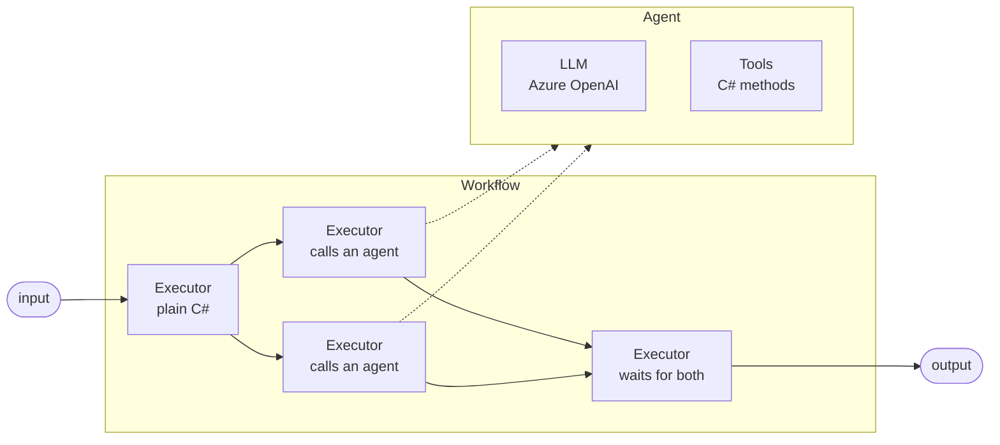
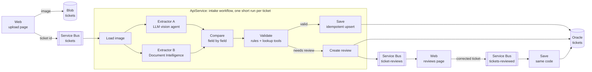
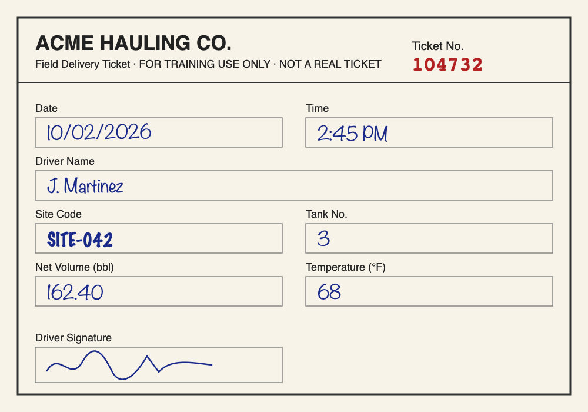

# agents-on-dotnet
Multi agent workflows using Microsoft Agent Framework.

## Core concepts (Agent Framework 1.23.0)

Official docs: [Get started](https://learn.microsoft.com/agent-framework/get-started/) · code samples: [agent-framework/dotnet/samples](https://github.com/microsoft/agent-framework/tree/main/dotnet/samples) (the source of truth for APIs; they compile against the current version).



Solid arrows are **edges** (typed messages between executors). Dotted arrows are calls from an executor into an **agent**. The split after the first executor is **fan-out**; the join is **fan-in**.

| Concept | What it is | API |
|---|---|---|
| **Agent** | An LLM with instructions and optional tools. It decides *what to say*. | `chatClient.AsAIAgent(instructions, name)`, `RunAsync<T>()` |
| **Executor** | One step of the workflow: plain code, or code that calls an agent. | `Executor<TIn, TOut>.HandleAsync` |
| **Edge** | Connects executors. The return value of one is the input message of the next, routed by type. | `AddEdge(a, b)` |
| **Fan-out / fan-in** | Run steps in parallel, then wait for all of them. | `AddFanOutEdge`, `AddFanInBarrierEdge` |
| **Workflow** | The graph. It decides *what happens next*: explicit, testable, auditable. | `new WorkflowBuilder(start)...Build()` |
| **Run + events** | One execution of the workflow for one input. It streams events (`ExecutorCompleted`, `ExecutorFailed`, `WorkflowOutput`). | `InProcessExecution.RunStreamingAsync`, `WatchStreamAsync()` |
| **Superstep** | Runs happen in rounds: every executor with a pending message runs (in parallel), and its outputs are delivered in the next round. | `SuperStepCompletedEvent` |
| **Checkpoint** | A run's state saved at the end of a superstep, so it can be restored later, even in another process. | `CheckpointManager`, `CheckpointInfo` |
| **Human-in-the-loop (in-workflow)** | The run emits a request and waits for a response. It's *not* a blocked thread: you checkpoint, dispose the run, and restore it when the answer arrives. | `RequestPort.Create<TReq, TRes>()`, `RequestInfoEvent` |

## TicketIntake: the design

Drivers fill in paper tickets by hand (ticket number, driver, site, tank, volume, temperature, date, signature). TicketIntake reads a photo of the ticket, cross-checks it, validates it, and saves it, or sends it to a person for review. All sample data is fictional.



### Design decisions (interview notes)

- **Two apps, from the [Aspire starter](https://aspire.dev/get-started/first-app/?aspire-lang=csharp).** `Web` (Blazor) has the upload and reviews pages and holds **no AI credentials**. `ApiService` runs the workflow and is the only app with roles on Azure OpenAI, Document Intelligence and the database (least privilege). A burst of tickets loads the worker, not the page reviewers use, and a crashed run doesn't take the UI down.

- **One run per ticket, and it's short (seconds).** Tickets don't wait on each other. A Service Bus processor runs them, and its `MaxConcurrentCalls` caps how many run in parallel. That cap is also my cost and rate-limit control (Azure OpenAI tokens per minute).
- **A review ends the run; the run doesn't pause.** A human review takes hours. The framework *could* pause the run: `RequestPort` + checkpoint, then resume later, with nothing held in memory. But I'd need a checkpoint store, and in-flight checkpoints can break when I deploy a new version of the workflow. The state a reviewer needs is small (both extractions, plus which fields disagree), and it belongs in a `reviews` table anyway, for audit. So "needs review" is **data + a message**, and the reviewer's answer starts a small new step that reuses the same Save code.
  - When I *would* use `RequestPort`: short, interactive approvals, such as a user approving a tool call in a chat, or a long multi-step run whose state is expensive to rebuild.
- **Reliability without checkpoints.** Service Bus uses peek-lock: the message is completed only after the run succeeds. If the process crashes, the message comes back and the whole run is retried. That's safe because Save is an **upsert by ticket number** (idempotent). After N failed attempts, the message goes to the **dead-letter queue** for a person to look at.
- **Two different extractors as a cross-check.** Fields where both agree are high confidence; disagreements get validated or reviewed. Two extractors only catch each other's mistakes if they fail *differently*: an LLM can fill in a plausible guess for a blurry digit, while OCR misreads characters but doesn't invent values. So:
  - **A: LLM vision agent** (`gpt-5-mini`). Reads messy handwriting using context, returns a typed `Ticket`.
  - **B: [Azure Document Intelligence](https://learn.microsoft.com/azure/ai-services/document-intelligence/overview) custom extraction model**, trained on labeled sample tickets (at least 5). It's a trained, non-generative model, so it's a truly independent second opinion. It gives **per-field confidence** (so "needs review" is a threshold) and **bounding boxes** (so the reviewer sees the crop of the image next to each disputed field, like page citations in RAG). Until the model is trained, `prebuilt-layout` key-value pairs is the stand-in.
  - Why not two LLMs with different prompts? They can make the same mistake, and neither gives per-field confidence.
  - Why not [Content Understanding](https://learn.microsoft.com/azure/ai-services/content-understanding/choosing-right-ai-tool)? It also gives confidence and grounding without labeling, but it's generative under the hood, so its errors would correlate with extractor A. Microsoft's own guidance: Document Intelligence for fixed templates (our tickets); Content Understanding for varied layouts (such as contracts), where I'd pick it.
  - This is automated **double-key verification**: the standard practice in manual data entry, where two people key the same form independently and a third resolves the differences.
- **Use the LLM only where judgment is needed.** Reading handwriting and fuzzy matching (is "J. Smth" driver `John Smith`?) use agents. Compare, rules and Save are plain C#: deterministic, unit-testable and cheap. The model never decides what gets written.
- **Structured output.** Both extractors return the same typed `Ticket` record (JSON schema enforced), so comparing and validating are plain C# code, not text parsing.
- **Security.** Keyless auth (Entra ID / managed identity) everywhere. The validation tools are **read-only**. The image is untrusted input (text in it could be a prompt injection), so the typed output and read-only tools limit what a bad image can do.

### Build steps

1. Workflow with one extractor: local image → `Ticket` (structured output).
2. Image from Blob (Azurite) + extractor B (Document Intelligence) in parallel (fan-out/fan-in) + compare.
3. Validation: rules + read-only lookup tools.
4. Save to Oracle (idempotent upsert).
5. Service Bus intake + review queue + dead-letter queue.
6. Evaluation: a golden set of tickets, with per-field accuracy.
7. Observability: Aspire dashboard traces + DevUI.

## Build it
```bash
# Scaffolded with the Aspire starter (Web + ApiService + AppHost + ServiceDefaults)
aspire new aspire-starter --name TicketIntake --output src/TicketIntake --suppress-agent-init
Use *.dev.localhost URLs [y/N]: y
✅ Using *.dev.localhost URLs for local development.
Use Redis Cache [Y/n]: n
Do you want to create a test project? [y/N]: n
📦 Using project templates version: 13.6.0
✅ Project created successfully in /Users/myname/RiderProjects/agents-on-dotnet/src/TicketIntake.
```

And
```bash
# 1. Azure OpenAI hosting integration (AppHost)
aspire add azure-cognitiveservices --apphost src/TicketIntake/TicketIntake.AppHost

# 2. Client packages (ApiService only)
dotnet add src/TicketIntake/TicketIntake.ApiService package Microsoft.Agents.AI.Workflows
dotnet add src/TicketIntake/TicketIntake.ApiService package Aspire.Azure.AI.OpenAI --prerelease
dotnet add src/TicketIntake/TicketIntake.ApiService package Microsoft.Extensions.AI.OpenAI
dotnet add src/TicketIntake/TicketIntake.ApiService package Azure.Identity

# 3. Azure secrets (AppHost)
dotnet user-secrets --project src/TicketIntake/TicketIntake.AppHost set Azure:SubscriptionId <sub-id>
dotnet user-secrets --project src/TicketIntake/TicketIntake.AppHost set Azure:TenantId <tenant-id>

# 4. Build, then run the starter once
dotnet build src/TicketIntake/TicketIntake.sln
aspire run --apphost src/TicketIntake/TicketIntake.AppHost # Or run it using the VScode extension
```

### Add secrets
Open .NET user secrets file and add these
```json
{
  "Azure:TenantId": "...",
  "Azure:SubscriptionId": "..."
}
```

### Run it

First run provisions `rg-agents-dev-eastus2` with Azure OpenAI and a `chat` deployment (`gpt-5-mini`, GlobalStandard). Check it: open `/model-check` on `apiservice` from the dashboard.


## Step 1: one extraction agent

A multimodal agent reads a ticket photo and returns a typed `Ticket` (structured output).



```bash
curl -k -F "image=@samples/tickets/ticket-001.png" https://apiservice-ticketintake.dev.localhost:7561/tickets/extract
```
```json
{"ticketNumber":"104732","pickupTime":"2026-10-02T14:45:00","driverName":"J. Martinez","siteCode":"SITE-042","tankNumber":"3","volumeBarrels":162.4,"temperatureF":68,"driverSigned":true}
```

All 8 fields correct. The dashboard's **Traces** show the model call with its token usage (and, in Development only, the prompt and the JSON schema sent to the model).

Read the code in this order:
1. [`Ticket.cs`](src/TicketIntake/TicketIntake.ApiService/Tickets/Ticket.cs): the shape. Nullable = "unreadable, don't guess"; `[Description]`s become part of the JSON schema.
2. [`TicketExtractor.cs`](src/TicketIntake/TicketIntake.ApiService/Tickets/TicketExtractor.cs): `AsAIAgent` + `RunAsync<Ticket>` with a text + image message.
3. [`Program.cs`](src/TicketIntake/TicketIntake.ApiService/Program.cs): keyless `IChatClient` registration and `POST /tickets/extract`.
4. [`AppHost.cs`](src/TicketIntake/TicketIntake.AppHost/AppHost.cs): Azure OpenAI + `chat` deployment, referenced by `apiservice` only.

Why:
- **Structured output** instead of parsing text: the model is held to `Ticket`'s JSON schema, and the result is a typed object the rest of the workflow can compare and validate in plain C#.
- **Prompt injection**: the image is untrusted. The instructions say to treat it as data, and the schema limits what the model can return to `Ticket` fields.
- Code changes need an `aspire run` restart (a running app keeps serving the old build; we hit a 404 because of that).
